# PAYGO 太阳能平台 — 演示流程手册

**版本**：V1.0
**日期**：2026-05-20
**系统地址**：http://localhost:8000/dashboard

---

## 一、业务背景与闭环总览

### 1.1 业务模型

```
┌──────────┐    ┌──────────┐    ┌──────────┐    ┌──────────┐    ┌──────────┐
│ MFI 贷款  │───→│ 客户签约  │───→│ 安装设备  │───→│ 分期还款  │───→│ Token续期 │
│ 信用评估  │    │ 选择产品  │    │ 绑定密钥  │    │ Bakong支付│    │ 设备解锁  │
└──────────┘    └──────────┘    └──────────┘    └──────────┘    └──────────┘
                                                       │
                                              ┌──────────▼──────────┐
                                              │      逾期管理        │
                                              │ 检测→锁定→催收→结清  │
                                              └─────────────────────┘
```

### 1.2 核心概念

| 概念 | 说明 |
|:---|:---|
| **OpenPAYGO Token** | 9 位纯数字激活码，基于 SipHash-2-4 哈希链生成，防重放 |
| **ADD_TIME** | 累加天数 Token，每次还款生成，客户输入后延长使用期限 |
| **DISABLE_PAYG** | 永久解锁 Token，贷款结清后生成，设备永久解除限制 |
| **Counter** | 单调递增计数器，防止 Token 重放攻击 |
| **等额本息** | 还款方式，每月固定金额，含本金+利息 |

### 1.3 四角色演示流程

```
运营总监 ─→ 仪表盘晨检 ─→ 报表导出
    │
    ▼
业务经理 ─→ 签合同(选产品+客户) ─→ 审批 ─→ 还款跟踪 ─→ 结清
    │
    ▼
运营专员 ─→ 客户360查询 ─→ Token补发 ─→ 告警处理 ─→ 批量生成
    │
    ▼
技术支持 ─→ 设备地图监控 ─→ 系统健康检查 ─→ 用户管理
```

---

## 二、演示准备

### 2.1 启动系统

```bash
cd paygo-platform
source venv/bin/activate
# 首次启动自动创建16张表+种子数据
uvicorn app.main:app --reload --host 0.0.0.0 --port 8000
```

### 2.2 加载演示数据

```bash
PYTHONPATH="." python scripts/seed_demo_data.py
```

加载后数据概览：

| 客户 | 设备 | 合同 | 状态 | GPS |
|:---|:---|:---|:---|:---|
| Sok Heng | DEV-KH-001 | 10kW-24月（2期已还） | 🟢 活跃·VIP | 金边 |
| Alice | DEV-KH-002 | 6kW-12月（1期已还） | 🟢 活跃 | 暹粒 |
| Bob | DEV-KH-003 | 15kW-24月（逾期） | 🔴 锁定·高风险 | 西港 |
| Sarun | DEV-KH-004 | 无 | ⚪ 待签约·新客户 | 磅湛 |

### 2.3 登录账号

| 角色 | 用户名 | 密码 | 权限 |
|:---|:---|:---|:---|
| 管理员（演示用） | `admin` | `admin123` | 全部权限 |

> 原型阶段使用单一管理员账号演示全部角色功能。生产环境可通过「系统设置→用户管理」创建不同角色账号。

---

## 三、角色一：运营总监 — 每日晨检（3分钟）

**目标**：快速掌握平台全局运行状态，识别异常

### 步骤 1：登录系统

1. 打开 http://localhost:8000/login
2. 输入用户名 `admin`，密码 `admin123`
3. 点击「登 录」

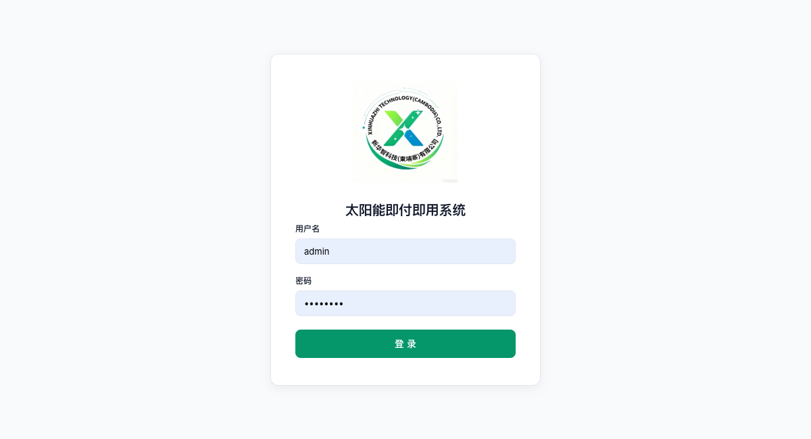

### 步骤 2：查看仪表盘 KPI 卡片

登录后默认进入「运营仪表盘」，查看 **8 张 KPI 卡片**：

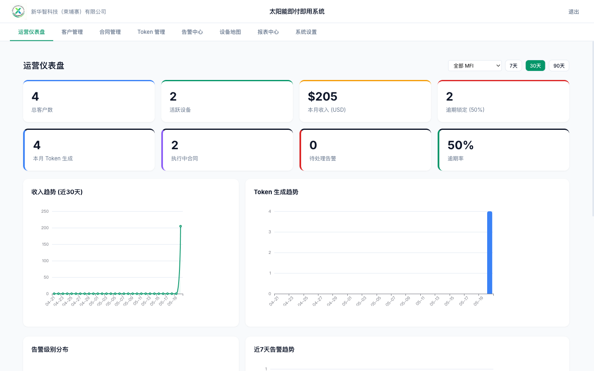

| KPI | 当前值 | 说明 |
|:---|:---|:---|
| 总客户数 | 4 | 平台累计注册客户 |
| 活跃设备 | 2 | 正常还款中的设备 |
| 本月收入 | $205 | 本月累计还款金额 |
| 逾期锁定 | 2（50%） | 逾期被锁定设备数和比率 |
| 本月 Token | 4 | 本月生成的 Token 数 |
| 执行中合同 | 2 | 处于 active 状态的合同 |
| 待处理告警 | 0 | 未处理的告警数量 |

### 步骤 3：查看趋势图表

向下滚动查看：

- **收入趋势折线图**（近 30 天每日收入）
- **Token 生成柱状图**（近 30 天每日 Token 数）
- **告警级别饼图**（P0/P1/P2 分布）
- **近 7 天告警趋势折线图**
- **设备状态饼图**（活跃/逾期/永久）

### 步骤 4：时间范围 + MFI 筛选

- 点击 **7天 / 30天 / 90天** 按钮切换统计范围
- 顶部 **MFI 下拉框** 可按机构筛选（默认"全部 MFI"）

### 步骤 5：KPI 下钻

- 点击「待处理告警」→ 跳转**告警中心**
- 点击「逾期锁定」→ 跳转**客户管理**查看逾期客户
- 点击「总客户数」→ 跳转**客户管理**

### 步骤 6：查看报表（可选）

1. 点击导航栏「**报表中心**」

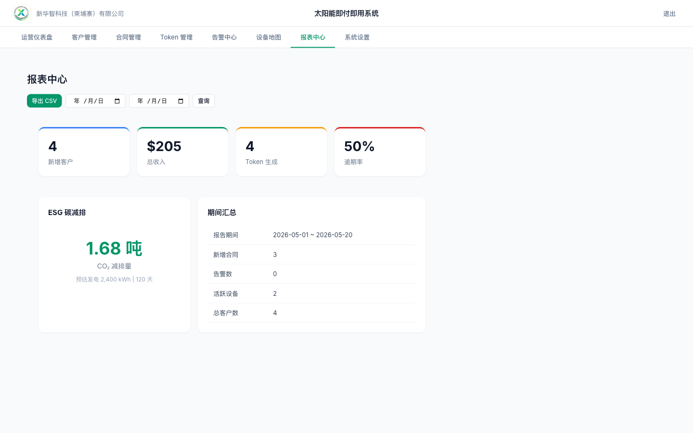

2. 查看：
   - **运营汇总**：新增客户、总收入、Token 数、逾期率
   - **ESG 碳减排**：CO₂ 减排量（吨）
3. 选择日期范围 → 点击「查询」
4. 点击「**导出 CSV**」下载报表

---

## 四、角色二：业务经理 — 合同全生命周期（核心闭环）

**目标**：走通「签合同 → 审批 → 还款 → 逾期检测 → 结清」完整业务闭环

### 步骤 1：确认贷款产品

1. 点击导航栏「**合同管理**」
2. 点击左侧「**⚙ 贷款产品配置**」
3. 确认 5 档产品：

| 产品名称 | 系统规模 | 期限 | 年利率 | 首付 | 总价(USD) |
|:---|:---|:---|:---|:---|:---|
| 6kW-12月基础 | 6kW | 12月 | 10% | 20% | $690 |
| 10kW-24月标准 | 10kW | 24月 | 12% | 20% | $1,150 |
| 15kW-24月标准 | 15kW | 24月 | 12% | 20% | $1,725 |
| 20kW-36月进阶 | 20kW | 36月 | 14% | 20% | $2,300 |
| 30kW-36月旗舰 | 30kW | 36月 | 14% | 20% | $3,450 |

### 步骤 2：创建合同

1. 先在「客户管理」确认有可用客户（若无，点「+ 新增」创建一个）
2. 切换到「合同管理」
3. 点击「**+ 新合同**」
4. 下拉选择客户（如 Chan Dara）
5. 下拉选择贷款产品（如 6kW-12月基础）
6. 点击「确认创建」

> 系统自动生成合同编号 `KH-YYYY-XXXXX`，合同进入**草稿**状态。
> 首付 20% = $138，贷款本金 = $552，等额本息月供 ≈ $48.53

### 步骤 3：审批通过

1. 点击刚创建的合同 → 右侧显示详情
2. 点击「**审批通过**」

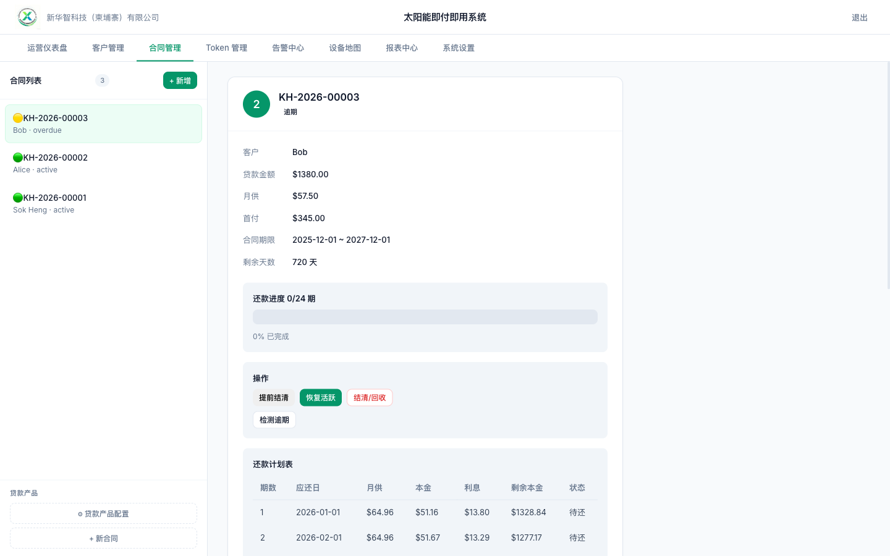

3. 系统自动：
   - 合同状态变为「**执行中**」
   - 生成 **12 期等额本息还款计划表**
   - 显示还款进度条：`0/12 期 · 0%`
   - 每期：应还日 / 月供 / 本金 / 利息 / 剩余本金 / 状态

### 步骤 4：模拟还款（第 1 期）

1. 在合同详情的「模拟还款」区
2. 点击「**第 1 期 · $48.53 · 日期**」
3. 弹窗显示：
   - **9 位 ADD_TIME Token**（如 `149883456`）
   - 模拟短信内容（收件人 + Token + 30天有效期）
4. 点击「完成」
5. 观察：还款进度条更新为 `1/12 · 8%`，该期状态变为 **已付**

### 步骤 5：检测逾期

1. 点击「**检测逾期**」按钮
2. 系统自动扫描所有到期未付的还款计划
3. Toast 提示「检测完成：N 条逾期计划已处理」

对于 Bob 的合同（15kW-24月，只还了 1 期，合同日期从 2025-12 开始），将检测到多期逾期：
- 到期未付期数 → 标记为「逾期」
- 合同状态变为「逾期」
- Bob 的设备状态变为「锁定」

### 步骤 6：提前结清

1. 选择执行中或逾期的合同
2. 点击「**提前结清**」
3. 确认弹窗 → 系统自动：
   - 生成 **DISABLE_PAYG Token**（永久解锁码，如 `343858109`）
   - 所有未付期数 → 标记已付
   - 合同状态 → **closed**
   - 客户状态 → **permanent**（永久解锁）

### 合同状态流转总结

```
draft(草稿) ──审批──→ active(执行中) ──逾期──→ overdue(逾期)
                        │                         │
                        ├──结清──→ closed(已结清)  ├──结清──→ closed
                        └──回收──→ recovered       └──回收──→ recovered
```

---

## 五、角色三：运营专员 — 日常客户服务

**目标**：处理客户咨询、Token 补发、告警处理

### 5.1 客户 360 视图查询

1. 点击导航栏「**客户管理**」
2. 在搜索框输入客户姓名（如 `Sok`）→ 实时筛选
3. 点击「Sok Heng」→ 右侧显示完整 360 视图：

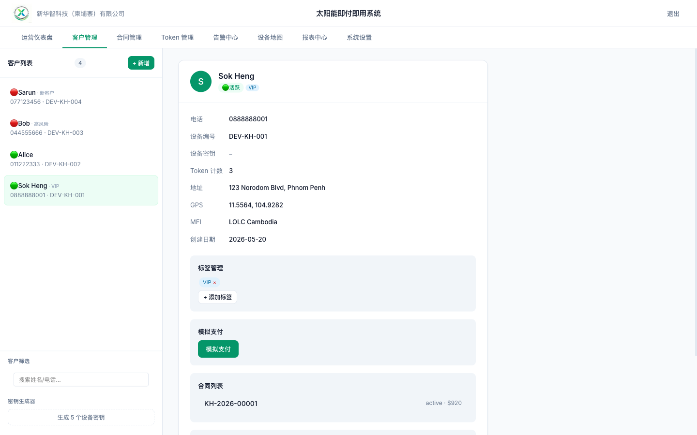

360 视图包含：
- **基本信息**：姓名、电话、设备编号、密钥(部分隐藏)、地址、GPS、MFI
- **标签管理**：VIP 标签（可添加/删除）
- **模拟支付**：下拉选择金额
- **合同列表**：点击合同编号可跳转合同详情
- **Token 历史时间线**：⚪未使用 / 🔴已作废
- **操作按钮**：锁定设备 / 永久解锁 / 删除客户

### 5.2 添加客户标签

1. 在客户详情 → 标签管理区
2. 点击「**+ 添加标签**」
3. 输入标签名：`VIP` / `高风险` / `投诉频繁` / `新客户`
4. 标签显示在客户详情和列表项中
5. 点击标签后的 **×** 可删除

### 5.3 模拟支付（生成 Token）

1. 选中客户，在详情面板找到「模拟支付」
2. 下拉选择金额：**$5.00 → 30天** 或 **$10.00 → 60天**
3. 点击「确认支付」
4. 弹窗显示：
   - **9 位 OpenPAYGO Token**
   - 模拟短信内容
5. 点击「完成」

### 5.4 Token 管理

点击导航栏「**Token 管理**」进入。

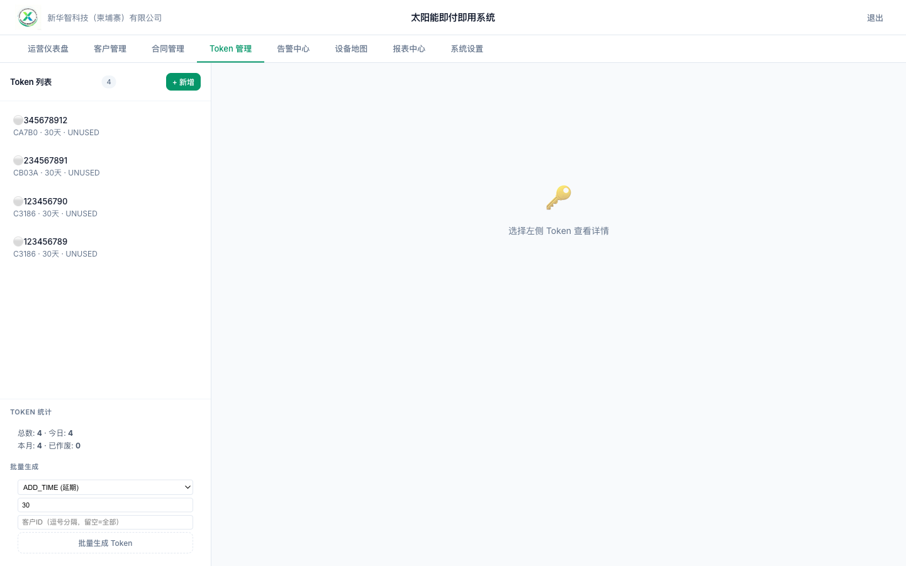

#### Token 列表与统计

- 左侧显示所有 Token，状态图标：⚪未使用 / 🟢已使用 / 🔴已作废
- 左侧底部统计卡片：总数 / 今日 / 本月 / 已作废

#### 查看 Token 详情

1. 点击任意 Token → 右侧显示详情：
   - Token 值、类型（ADD_TIME/DISABLE_PAYG）、天数
   - 客户名、金额、Counter、生成时间、过期时间
   - 关联合同 ID
   - 作废原因（如已作废）

#### Token 作废（安全事件）

1. 在 Token 详情页，点击「**作废 Token**」
2. 输入作废原因（如"客户投诉 Token 泄露"）
3. Token 状态 → SUPERSEDED，记录操作人

#### Token 补发（客户未收到 SMS）

1. 找到一个「未使用」状态的 Token
2. 点击「**补发 Token**」
3. 确认弹窗 → 系统生成新 Token（Counter+1）
4. 原 Token → SUPERSEDED
5. Toast 提示「新 Token 已生成: XXXXXXXX」

#### 批量生成 Token

1. 左侧底部「批量生成」区：
   - 选择 Token 类型（ADD_TIME / SET_TIME / DISABLE_PAYG）
   - 输入天数（如 30）
   - 输入客户 ID（逗号分隔，留空=全部客户）
2. 点击「批量生成 Token」
3. 确认弹窗 → 生成成功

### 5.5 告警处理

点击导航栏「**告警中心**」进入。

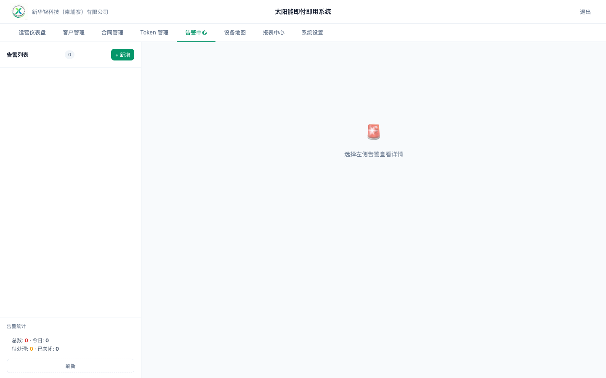

#### 查看告警列表

- 左侧告警列表按级别排序：**P0(红) > P1(黄) > P2(蓝)**
- 左侧统计：总数 / 今日 / 待处理 / 已关闭

#### 处理一条告警

1. 点击一条「待处理」告警
2. 查看详情：
   - 级别 + 标题 + 详情描述
   - 规则编码（ALM-001/002/003）
   - 触发时间
   - 关联合同 ID + 客户 ID
3. 点击「**认领告警**」→ 状态变为「已认领」
4. 实际处理（模拟：直接点解决）
5. 点击「**标记解决**」→ 输入备注
6. 告警状态变为「已关闭」

#### 升级告警

1. 点击「**升级**」按钮
2. P2 → P1，P1 → P0
3. 操作日志记录升级事件

#### 查看操作日志

告警详情底部显示完整时间线：
```
2026-05-20 triggered — 规则 ALM-001 触发告警
2026-05-20 claimed by admin
2026-05-20 escalated — 升级至 P1
2026-05-20 resolved — 已联系客户
```

---

## 5.6 设备控制器模拟（Web + 终端双模式）

**目标**：模拟 PAYGO Dongle 硬件行为，验证 Token→解锁的完整设备链路

### Web 版模拟器（推荐，安卓手机可用）

1. 点击导航栏右上角「**📱 设备模拟器**」或访问 `/controller`
2. 深色终端风格 UI，模拟真实 Dongle 界面
3. 下拉选择设备 → 显示：密钥/状态/Count/继电器

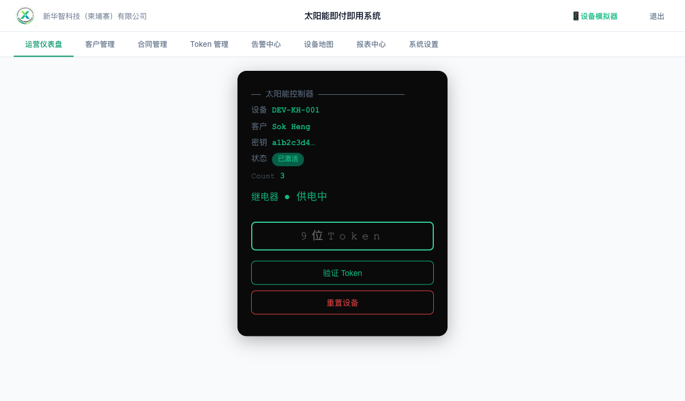

**模拟操作流程**：
```
1. 在平台完成一笔模拟支付 → 获得 9 位 Token
2. 切换到控制器页面 → 选择对应设备
3. 输入 9 位 Token → 点击「验证 Token」
4. ✓ 验证成功 · +30 天 → 继电器 ● 供电中


5. 再次输入同一 Token → ✗ Token 已使用（防重放）

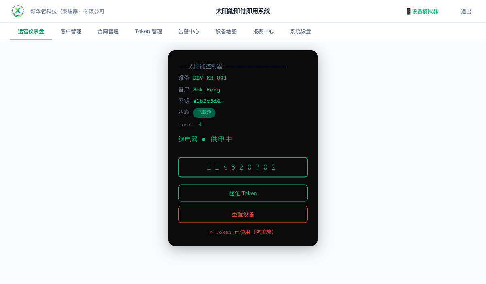

6. 结清合同 → 获得 DISABLE_PAYG Token
7. 输入 DISABLE_PAYG Token → ✓✓ 永久解锁
```

**安卓手机使用**：
```
手机连接同一 WiFi → 浏览器打开 http://<服务器IP>:8000/controller
登录 → 选设备 → 输入 Token → 验证
```

### 终端模拟器（桌面开发调试）

```bash
cd paygo-platform && source venv/bin/activate
cd controller && python controller.py
```
- 初始设置：输入 32 位 hex 密钥绑定设备
- `N` → 输入 9 位 Token → 本地解码验证
- `D` → 快进天数（模拟时间流逝，天数递减）
- `R` → 重置设备
- 实时显示：密钥/状态/剩余天数/继电器/Count

---

## 六、角色四：技术支持 — 设备监控与系统管理

### 6.1 设备地图

点击导航栏「**设备地图**」进入。

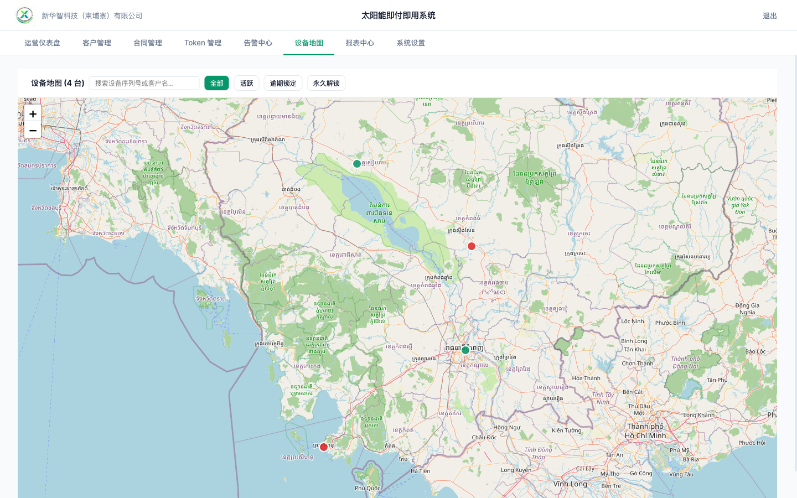

#### 地图操作

- **柬埔寨全境地图**：Leaflet + OpenStreetMap
- **颜色标注**：
  - 🟢 绿色圆点 = 活跃设备
  - 🔴 红色圆点 = 逾期锁定
  - 🟡 黄色圆点 = 永久解锁
- **点击标注** → Popup 显示：客户名、设备编号、状态

#### 图层切换

点击顶部按钮：**全部 / 活跃 / 逾期锁定 / 永久解锁**

#### 设备搜索

- 在搜索框输入设备序列号或客户名
- 匹配到单个设备时 → 自动聚焦 zoom 14

### 6.2 系统设置

点击导航栏「**系统设置**」进入。

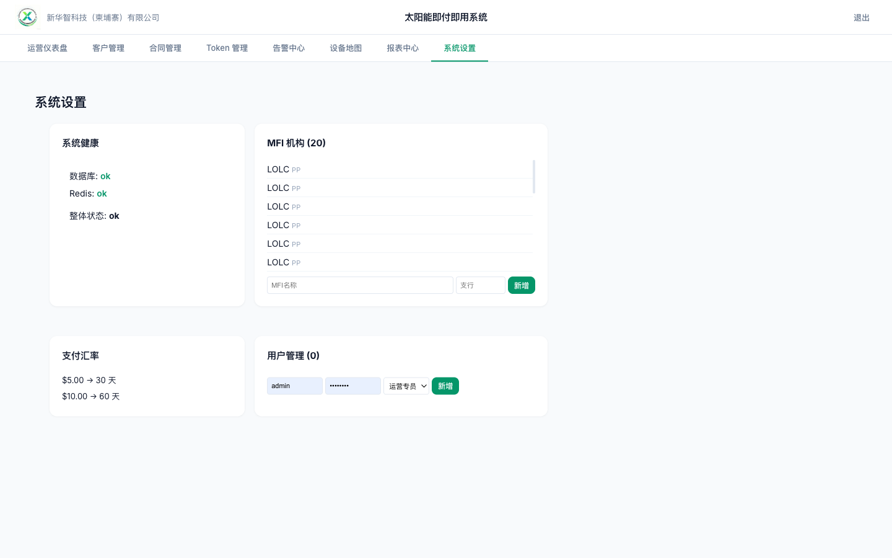

#### 系统健康检查

- 数据库状态：ok / error
- Redis 状态：ok / error
- 整体状态

#### MFI 机构管理

- 查看已有 MFI 列表（名称 + 支行）
- 输入名称 + 支行 → 点击「新增」

#### 支付汇率管理

- 查看当前汇率映射（$5 → 30天 / $10 → 60天）

#### 用户管理

- 查看已有用户（用户名 + 角色）
- 输入用户名 + 密码 + 选择角色 → 点击「新增」
- 可用角色：
  - `ops_staff` 运营专员
  - `ops_manager` 运营主管
  - `tech_support` 技术支持
  - `readonly` 只读

---

## 七、安全功能演示

### 7.1 登录安全

1. 打开登录页
2. 输入 `admin` + 错误密码 → 「用户名或密码错误」
3. 连续输入 **5 次**错误密码
4. 第 6 次尝试 → 「账户已被锁定，请 XXX 秒后重试」

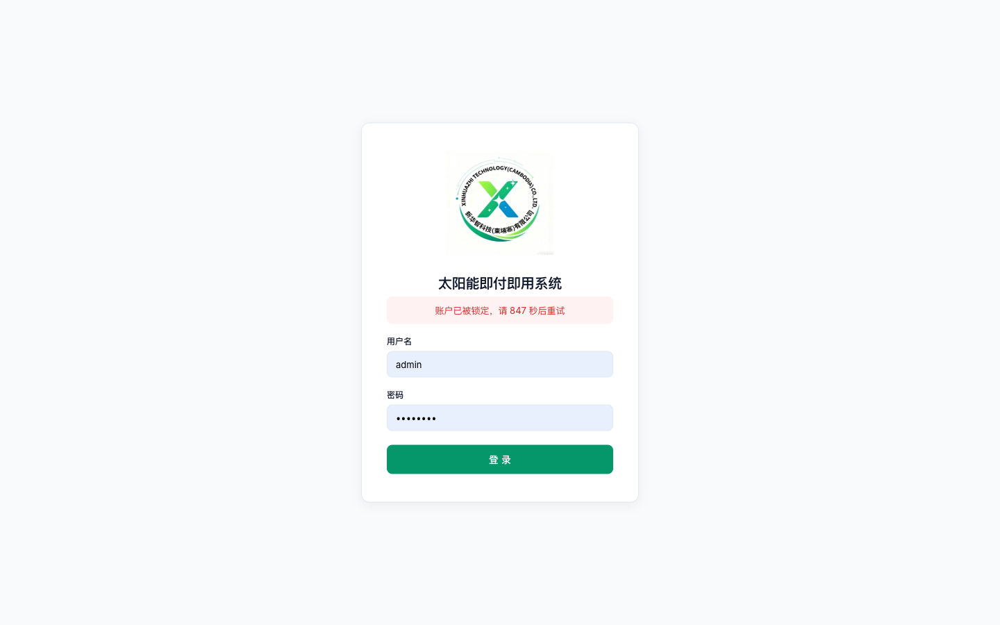

### 7.2 其他安全特性

| 功能 | 说明 |
|:---|:---|
| 密码 bcrypt 哈希 | 管理员密码使用 bcrypt 存储，非明文 |
| 设备密钥加密 | 使用 Fernet AES 对称加密存储 |
| API 限流 | 登录 10次/min，API 100次/min |
| JWT 认证 | 支持 Bearer Token + Cookie 双模式 |
| 请求日志 | 每个 API 请求记录方法/路径/状态/耗时/IP |

---

## 八、完整演示流程（按清单顺序）

建议按以下顺序进行演示，约 **15 分钟**完成全部功能展示：

```
时间    步骤    操作
0:00    1       登录 admin/admin123
0:30    2       仪表盘：介绍8张KPI卡片 + ECharts图表
1:30    3       仪表盘：切换7天/30天 + MFI筛选
2:00    4       客户管理：展示客户列表 + 搜索功能
2:30    5       客户管理：点击Sok Heng → 360视图
3:00    6       客户管理：添加标签 + 展示合同卡片 + Token时间线
3:30    7       客户管理：选中Sarun → 模拟支付$5 → Token弹窗
4:30    8       合同管理：展示合同列表 + 贷款产品配置
5:00    9       合同管理：创建新合同（选Chan Dara+6kW-12月）
5:30    10      合同管理：审批通过 → 还款计划表展示
6:30    11      合同管理：还款第1期 → 进度条变化
7:00    12      合同管理：检测逾期 → Bob合同标记逾期
7:30    13      合同管理：提前结清 → DISABLE_PAYG Token
8:00    14      Token管理：展示Token列表 + 统计
8:30    15      Token管理：查看详情 → 作废 → 补发
9:30    16      Token管理：批量生成
10:00   17      告警中心：展示告警列表 + 详情 + 操作日志
10:30   18      告警中心：创建告警 → 认领 → 解决 → 升级
11:30   19      设备地图：GPS标注展示 + 图层切换 + 搜索
12:30   20      报表中心：汇总 + ESG + CSV导出
13:30   21      系统设置：健康检查 + MFI + 用户管理
13:30   22      控制器：打开 /controller → 选择设备 → 输入 Token → 验证成功
13:45   23      控制器：演示防重放（同一Token再次输入）→ DISABLE_PAYG永久解锁
14:00   24      登出 → 演示登录锁定（5次错误密码）
14:30   25      总结：8个Tab + 控制器全部覆盖
```

---

## 九、附录：API 端点速查

| 模块 | 关键端点 |
|:---|:---|
| 仪表盘 | `GET /api/dashboard/enhanced-stats?days=30` |
| 客户 | `GET /api/customers/{id}/360`, `POST /api/customers/{id}/simulate-payment` |
| 合同 | `POST /api/contracts`, `PUT /api/contracts/{id}/approve`, `POST /api/contracts/{id}/pay` |
| Token | `GET /api/tokens/stats`, `POST /api/tokens/{id}/reissue`, `POST /api/tokens/batch-generate` |
| 告警 | `GET /api/alerts/{id}`, `POST /api/alerts/{id}/claim`, `POST /api/alerts/{id}/resolve` |
| 设备 | `GET /api/devices/geo` |
| 报表 | `GET /api/reports/summary`, `GET /api/reports/esg` |
| 设置 | `GET /api/settings/health`, `POST /api/settings/users` |

---

## 十、模拟边界说明

以下功能在**原型阶段仅做模拟**，部署到云也无法真实对接：

| 功能 | 模拟方式 | 真实对接条件 |
|:---|:---|:---|
| Bakong 支付 | 页面按钮 → 手动确认 + 自动触发 Token | 柬埔寨国家银行 API 权限 |
| SMS 网关 | 弹窗展示短信内容 + DB 记录 | Cellcard/Smart SMPP 企业账号 |
| MQTT 设备通信 | DB 手动更新设备状态 | 硬件控制板（ESP32/Dongle） |
| MFI CBS 同步 | 管理后台手动录入 | MFI 核心银行系统 API |
